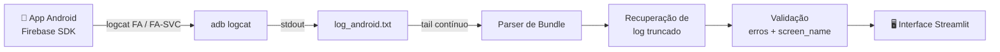

# 🐦 Zazu

**Debugger visual de eventos GA4 / Firebase Analytics para apps Android.**

Zazu transforma o ruído do `adb logcat` em uma interface legível: cada evento disparado pelo app aparece na tela com nome, timestamp, parâmetros formatados, lista de produtos em cards e alertas automáticos de erro — em tempo real, enquanto você navega no celular.

> Antes: você abre um `.txt` de milhares de linhas e caça `Bundle[{...}]` no meio do log do sistema.
> Depois: você olha a tela e vê o evento chegando, já parseado e validado.

---

## 📌 Por que existe

Validar implementação de Analytics em app é um trabalho manual e cansativo. As opções tradicionais são:

| Alternativa | Problema |
| --- | --- |
| Ler `adb logcat` cru | Bundle aninhado, linhas cortadas, log do sistema misturado |
| DebugView do Firebase | Latência de minutos e sem visão de parâmetros brutos |
| Proxy (Charles / mitmproxy) | Setup de certificado, SSL pinning, configuração por dispositivo |

Zazu fica no meio: **zero configuração de rede, latência de milissegundos e o payload exato que o SDK montou.**

---

## ✨ O que ele faz

**Captura e streaming**
- Habilita o modo verbose do Firebase Analytics no dispositivo e escuta as tags `FA` e `FA-SVC`.
- Amplia o buffer do logcat para 16 MB para não perder eventos em sessões longas.
- Lê o log em append contínuo — o evento aparece na tela no instante do disparo.

**Parsing do Bundle do Android**
- Converte a notação `Bundle[{name=view_item, params=Bundle[{...}]}]` em estrutura navegável.
- Trata aninhamento real: bundles dentro de bundles e arrays dentro de arrays (`items`, `params`).

**Recuperação de log truncado**
- O logcat corta linhas em ~4 KB, o que quebra eventos de `purchase` com muitos itens.
- Zazu conta os delimitadores abertos e fechados, descarta o fragmento incompleto, refecha a estrutura e continua exibindo o que foi capturado.
- O evento recebe a etiqueta **⚠️ LOG CORTADO ( > 4KB )** e a seção de produtos é marcada como *(Parcial)* — você nunca confunde dado ausente com dado errado.

**Validação automática**
- **🐛 Bug detectado** — o SDK reportou erro de implementação. Detecta `ga_error`, `ga_error_length`, `ga_error_value` e os aliases curtos `_err`, `_el`, `_ev`. O parâmetro problemático é destacado em vermelho e um botão leva direto à documentação oficial de erros do Firebase.
- **⚠️ Falta screen_name** — `screen_view` sem `ga_screen` / `_sn`. Um dos erros mais comuns e mais silenciosos em implementação de app.

**Leitura de e-commerce**
- O array `items` é renderizado como cards, um por produto, com `item_name` e `item_id` no cabeçalho e todos os parâmetros em grid.
- Eventos de `purchase` e eventos com problema abrem os detalhes automaticamente.

---

## 🏷️ Taxonomia visual

Cada evento recebe uma cor e um ícone conforme a categoria — dá para varrer a tela e achar o que interessa sem ler nome por nome.

| Categoria | Ícone | Eventos |
| --- | --- | --- |
| Início de sessão | 🏁 | `session_start` |
| E-commerce | 🛍️ | `view_item`, `view_item_list`, `select_item`, `add_to_cart`, `remove_from_cart`, `view_cart`, `begin_checkout`, `add_shipping_info`, `add_payment_info`, `purchase` |
| Navegação | 👀 | `screen_view` |
| Promoção | 🎟️ | `view_promotion`, `select_promotion` |
| Outros / sistema | 🔹 | qualquer outro evento, incluindo eventos customizados |

A correspondência é por substring: `view_item_promo_home`, por exemplo, cai em e-commerce.

---

## 🔧 Pré-requisitos

- **Python 3.10 ou superior** (o projeto foi desenvolvido em 3.14).
- **ADB / Android Platform Tools** — [download oficial](https://developer.android.com/tools/releases/platform-tools?hl=pt-br).
- **Dispositivo Android físico** com cabo de dados **ou** emulador do Android Studio.
- O **app alvo instalado** no dispositivo e o **package name** dele.

---

## ⚙️ Preparando o dispositivo

Zazu lê o log do sistema, então a depuração precisa estar liberada:

1. **Configurações** → **Sobre o telefone**.
2. Toque 7 vezes em **Número da versão** (Build Number), até aparecer *"Você agora é um desenvolvedor"*.
3. Volte em **Configurações** → **Sistema** → **Opções do desenvolvedor**.
4. Ative **Depuração por USB**.
5. Conecte o cabo e **aceite o prompt de autorização** que aparece na tela do celular.

Confirme que o dispositivo foi reconhecido:

```bash
adb devices
```

Se a lista vier vazia, nada em Zazu vai funcionar — resolva isso primeiro.

> Emulador do Android Studio já vem com depuração habilitada. Basta ele estar rodando.

---

## 📦 Instalação

```bash
pip install streamlit
```

O `adb` precisa estar acessível pelo terminal. Escolha uma das opções:

- **Recomendado:** adicione a pasta `platform-tools` ao `PATH` do sistema e rode Zazu de qualquer diretório.
- **Alternativa rápida:** coloque o `app.py` dentro da própria pasta `platform-tools`.

---

## ▶️ Uso

Com o celular conectado e desbloqueado:

```bash
python -m streamlit run app.py
```

No navegador:

1. Abra a **barra lateral** (ícone `»` no canto superior esquerdo).
2. Preencha o **Package Name** do app alvo — ex.: `com.dominio.app`.
3. Clique em **🔌 Conectar e iniciar**.
4. Navegue no celular. Os eventos aparecem na tela conforme são disparados.

Controles da barra lateral:

| Botão | Efeito |
| --- | --- |
| 🔌 **Conectar e iniciar** | Liga o modo debug no dispositivo e começa a capturar |
| ❌ **Parar** | Encerra o processo de captura |
| 🗑️ **Limpar** | Zera o log e a tela, mantendo a captura ativa |

### Descobrindo o package name

```bash
# lista todos os pacotes instalados, filtrando por um termo
adb shell pm list packages | grep minhaempresa

# mostra o pacote do app que está em primeiro plano agora
adb shell dumpsys window | grep mCurrentFocus
```

---

## 🧭 Como funciona



**Passo a passo do que acontece ao clicar em Conectar:**

1. `adb logcat -c` limpa o buffer, e `-G 16M` amplia a capacidade.
2. `setprop debug.firebase.analytics.app <package>` liga o modo debug do SDK **apenas para o app informado**.
3. `setprop log.tag.FA VERBOSE` e `log.tag.FA-SVC VERBOSE` fazem o SDK logar o payload completo de cada evento.
4. Um `adb logcat -v time -s FA FA-SVC` roda em background gravando em `log_android.txt`.
5. A interface abre o arquivo, posiciona no fim e faz *tail*: cada linha com `Logging event:` é parseada, validada e renderizada.

---

## 🩺 Solução de problemas

| Sintoma | Causa provável e o que fazer |
| --- | --- |
| Fica em *"Aguardando log..."* e nada aparece | Package name errado. Confirme com `adb shell dumpsys window \| grep mCurrentFocus` com o app aberto. |
| `adb devices` não lista o aparelho | Cabo só de carga, depuração USB desligada ou prompt de autorização não aceito na tela do celular. |
| `'adb' não é reconhecido` | `adb` fora do `PATH`. Adicione a `platform-tools` ao `PATH` ou mova o `app.py` para lá. |
| Eventos vêm com **⚠️ LOG CORTADO** | Comportamento esperado do logcat em payloads grandes. Os dados exibidos são válidos, mas parciais. |
| Nenhum evento após reinstalar o app | O `setprop` de debug não sobrevive a reboot do aparelho. Pare e inicie a captura novamente. |
| Log de outro app aparecendo | Só um package fica em modo debug por vez. Reinicie a captura com o package correto. |

---

## ⚠️ Limitações conhecidas

- **Somente Android.** iOS não expõe os eventos do Firebase via `adb`.
- **Um app por sessão de captura.** A propriedade `debug.firebase.analytics.app` aceita um único package.
- **`log_android.txt` é recriado a cada início de captura** — é um arquivo de trabalho, não histórico. Exporte antes se precisar guardar.
- **Eventos acima de ~4 KB chegam parciais** por limite do logcat, sinalizados na interface.
- **O feed é ao vivo, sem filtro nem busca.** Para inspecionar um evento específico, use o botão Limpar antes de reproduzir a ação no app.
- **Ferramenta local de desenvolvimento.** Ela lê o log do dispositivo conectado e não deve ser exposta em rede.

### Nota de comportamento

Na categorização, `purchase` está listado no grupo de e-commerce e recebe o badge 🛍️ — a ramificação 💸 declarada em seguida no código nunca é alcançada. Não afeta o parsing nem a validação, só a cor da etiqueta.

---

## 🗂️ Estrutura

```
Zazu/
├── app.py            # aplicação completa: captura, parser, validação e UI
├── log_android.txt   # gerado em execução (buffer de captura)
├── LICENSE
└── README.md
```

Aplicação de arquivo único, sem dependências além do Streamlit. Todo o parsing é feito com a biblioteca padrão do Python.

---

## 📄 Licença

MIT — veja [LICENSE](LICENSE).

---

<sub>Zazu leva o que acontece no app direto para quem precisa ouvir.</sub>
